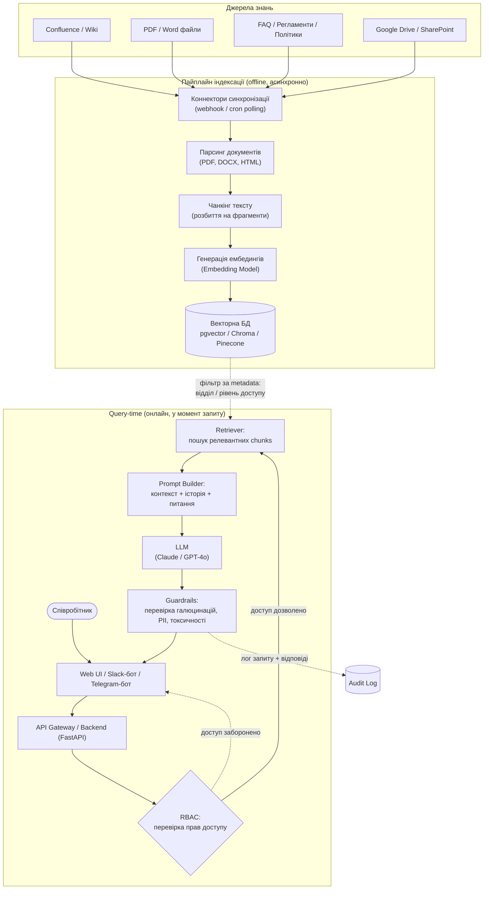

# AI-база знань для співробітників (RAG-система)
### Технічна пропозиція, архітектура та MVP-демонстрація

---

## Executive Summary

Компанія накопичила значний обсяг внутрішніх знань — регламенти, інструкції, навчальні матеріали, скрипти продажів, FAQ, політики — розпорошених по різних системах (Confluence, файлові сховища, Google Drive, папки з документами). Співробітники витрачають час на пошук потрібної інформації або відволікають колег і керівників повторюваними питаннями.

Пропоноване рішення — **AI-асистент на основі Retrieval-Augmented Generation (RAG)**, який відповідає на питання співробітників природною мовою, спираючись **виключно на верифіковану внутрішню базу знань компанії**, а не на загальні знання LLM. Це дає точні, актуальні, контекстуальні відповіді з посиланням на джерело — без потреби перенавчувати модель щоразу, коли змінюється документ.

Документ нижче описує повну архітектуру рішення (Частина 1) та містить готовий до запуску код MVP-демо (Частина 2).

---

## Частина 1. Технічна пропозиція

### 1. Архітектура рішення

В основі рішення — **RAG (Retrieval-Augmented Generation)**: замість того, щоб "зашивати" знання компанії у ваги моделі (fine-tuning), ми зберігаємо документи у **векторній базі даних** у вигляді ембедингів (числових представлень смислу тексту) і на кожен запит користувача:

1. **Retrieval (пошук):** запит співробітника перетворюється на ембединг і використовується для пошуку `k` найбільш релевантних фрагментів документів (chunks) у векторній БД (semantic search).
2. **Augmentation (доповнення контексту):** знайдені фрагменти вставляються у промпт як контекст.
3. **Generation (генерація):** LLM (Claude/GPT) формує відповідь **на основі цього контексту**, а не "з голови", що суттєво знижує ризик галюцинацій і дозволяє посилатися на конкретний документ-джерело.

**Чому RAG, а не fine-tuning:** RAG дешевший, не вимагає перенавчання при кожному оновленні документації, дає прозорість (можна показати джерело відповіді) і легше контролюється з точки зору доступу до конфіденційних даних (можна фільтрувати, що саме потрапляє в контекст, для конкретного користувача).

#### Схема архітектури



**Ключові компоненти:**
- **Indexing pipeline** (нижня частина) працює асинхронно, окремо від запитів користувачів — оновлення бази знань не впливає на швидкість відповідей.
- **Query-time pipeline** (права частина) — синхронний шлях запиту, де RBAC-перевірка відбувається **до** того, як retriever отримує доступ до векторної БД, а не після генерації відповіді.
- **Guardrails** на виході перевіряють відповідь LLM перед тим, як показати її користувачу.

---

### 2. AI-інструменти, моделі та технології

Рекомендований стек побудований на широко використовуваних, добре підтримуваних інструментах, що дозволяє швидко вийти в MVP і безпечно масштабувати рішення до Production.

| Шар | Технологія | Обґрунтування |
|---|---|---|
| **Frontend** | Next.js 14+ (App Router) + Tailwind CSS | SSR/SSG з коробки, швидка розробка UI, легка інтеграція зі стрімінгом відповідей |
| **Backend / API** | Python + FastAPI | Async з коробки, автогенерація OpenAPI-документації, найкраща сумісність з AI/ML-екосистемою Python |
| **Оркестрація LLM** | LangChain (альтернатива — LlamaIndex) | Готові абстракції для loaders, splitters, retrievers, LCEL-чейнів; велика community |
| **LLM (генерація)** | Anthropic Claude (напр. Sonnet 5) або OpenAI GPT-4o | Обидва підтримують function calling, великий контекст, enterprise-угоди про непередачу даних на тренування |
| **Embeddings** | OpenAI `text-embedding-3` (або локальна `bge-m3` для чутливих даних) | Висока якість семантичного пошуку; локальна модель — опція для even жорсткіших вимог до приватності |
| **Векторна БД** | Supabase (pgvector) для Production; Chroma — для MVP/pilot | pgvector дає SQL + vector search в одній БД (простіше DevOps); Chroma — швидкий старт без інфраструктури |
| **Черги / асинхронна обробка** | Celery + Redis, або n8n для no-code інтеграцій | Індексація документів не повинна блокувати API-запити |
| **Інтеграції** | Slack Bolt SDK, python-telegram-bot, REST API | Співробітники working де їм зручно, без перемикання контексту |
| **Auth / RBAC** | Корпоративний SSO (SAML/OIDC) + Keycloak/Auth0 | Єдина точка автентифікації, прив'язка ролей/відділів до фільтрації документів |
| **Guardrails / Moderation** | NeMo Guardrails або Llama Guard, Microsoft Presidio (PII) | Захист від prompt injection, витоку PII, токсичного контенту |
| **Моніторинг LLM** | Langfuse або LangSmith | Трейсинг запитів, оцінка якості (RAGAS-метрики), відстеження вартості |
| **Інфраструктура / деплой** | Docker, Kubernetes (Helm-чарти), CI/CD (GitHub Actions) | Відтворюваність середовищ, горизонтальне масштабування backend |

---

### 3. Робота з документами: пайплайн обробки

Якість RAG-системи на 70% визначається якістю пайплайну обробки документів, а не вибором LLM. Пайплайн складається з трьох етапів:

**3.1. Парсинг (Parsing)**
- **PDF:** `PyPDFLoader` / `unstructured` для тексту; OCR fallback (Tesseract) для сканованих сторінок і зображень.
- **Word (.docx):** `Docx2txtLoader` або `python-docx` зі збереженням структури заголовків.
- **Confluence:** офіційний REST API / `ConfluenceLoader` з інкрементальною синхронізацією за `lastModified`.
- **HTML / Web-сторінки:** `BeautifulSoup`-based loaders з очищенням навігації/футерів.
- Кожен документ під час парсингу отримує **метадані**: `source`, `document_id`, `department`, `access_level`, `last_updated` — це критично для розділу 4 (актуальність) і розділу 6 (RBAC).

**3.2. Чанкінг (Chunking Strategies)**
- **Recursive character splitting** (базовий підхід) — розбиття по параграфах/реченнях із розміром чанку **500–1000 токенів** і **overlap 10–15%**, щоб не розривати думку на межі чанку.
- **Structure-aware chunking** — розбиття за заголовками Markdown/HTML (H1/H2/H3) для регламентів і інструкцій, де ієрархія розділів несе смисл.
- **Semantic chunking** (просунутий підхід) — розбиття за зміною теми на основі similarity між сусідніми реченнями; корисно для довгих неструктурованих документів.
- Для FAQ і Q&A-документів — **чанк = одна пара "питання-відповідь"**, без додаткового розбиття.

**3.3. Ембединги (Embeddings)**
- Батч-генерація ембедингів для всіх чанків одного документа за один API-виклик (economy на латентності й вартості).
- Векторизований чанк зберігається разом з metadata → дозволяє **фільтрацію на етапі пошуку** (наприклад, "шукати тільки серед документів HR-відділу").
- Рекомендація: version-tag ембединг-моделі в метаданих (`embedding_model: text-embedding-3-small`), щоб у майбутньому можна було безпечно мігрувати на іншу модель без плутанини старих/нових векторів в одній колекції.

---

### 4. Актуальність інформації (Freshness & Sync)

Застаріла база знань — головний ризик довіри користувачів до AI-асистента. Пропонований підхід:

- **Інкрементальна синхронізація:** для Confluence/Wiki — webhook на подію `page_updated`; для файлових сховищ — періодичний polling (cron, напр. кожні 15–60 хв) з перевіркою `hash` контенту документа (щоб не переобробляти незмінені файли).
- **Upsert-паттерн замість повного переіндексування:** кожен документ має стабільний `document_id`. При оновленні — видаляються всі старі вектори з цим `document_id`, документ переобробляється і вставляються нові вектори. Це уникає дублікатів і "мертвих" застарілих відповідей.
- **Soft delete / TTL:** якщо документ видалено з джерела — його вектори позначаються `deleted=true` і виключаються з retrieval (а не видаляються фізично одразу — для аудиту й можливості відновлення).
- **Інвалідація кешу:** якщо використовується кеш готових відповідей (Redis, для частих FAQ-питань) — кеш-записи прив'язуються до `document_id` джерел, які формували відповідь; оновлення документа інвалідовує лише пов'язані записи, а не весь кеш.
- **Event-driven decoupling:** черга повідомлень (RabbitMQ/SQS) між "джерело змінилося" і "переіндексувати" — індексація не блокує основний API і переживає тимчасову недоступність джерела.
- **Дата "останньої перевірки бази знань"** показується користувачу в UI — прозорість щодо актуальності відповіді.

---

### 5. Взаємодія зі співробітниками

Мета — зустріти співробітника там, де він вже працює, без додаткового "ще одного інструменту для входу".

**Канали:**
- **Web UI (основний):** chat-інтерфейс на кшталт ChatGPT — швидкий MVP, повний контроль над UX (показ джерел, feedback-кнопки, streaming відповіді).
- **Slack-бот:** slash-команда `/ask` або реакція на mention бота в каналі; відповідь у треді, щоб не "шуміти" в основному каналі.
- **Telegram-бот:** для компаній, де основна комунікація йде через Telegram (часто в українських командах); webhook-based bot.

**UX/UI принципи:**
- **Streaming відповідей** (token-by-token) — відчуття швидкості, навіть якщо повна генерація займає кілька секунд.
- **Обов'язкове цитування джерел** — кожна відповідь супроводжується посиланням на документ(и), з яких взято інформацію.
- **Чесна відмова замість вигадки:** якщо релевантної інформації в базі немає — асистент прямо каже "не знайшов цього в базі знань", а не імпровізує.
- **Feedback loop:** кнопки 👍/👎 під відповіддю — дані йдуть в аналітику для покращення retrieval і виявлення "дірок" у базі знань.
- **Ескалація на людину:** кнопка "Передати колезі/HR" для питань поза компетенцією асистента (наприклад, дуже персоналізовані кейси).
- **Історія діалогу (multi-turn):** асистент розуміє контекст попередніх повідомлень у межах сесії.

---

### 6. Ризики та їх мінімізація

| Ризик | Опис | Мінімізація |
|---|---|---|
| **Галюцинації** | LLM "вигадує" факт, якого немає в базі знань | Строгий system-промпт "відповідай лише з контексту"; `temperature=0`; обов'язкове цитування джерел; поріг релевантності retrieval (якщо схожість нижче порогу — відповідь "не знайдено") |
| **Доступ до конфіденційних даних** | Співробітник отримує відповідь на основі документів, до яких у нього немає прав доступу | **Role-Based Access Control (RBAC)** на рівні retrieval: кожен чанк має метадані `access_level`/`department`; фільтр застосовується **до** пошуку у векторній БД, а не після |
| **Data leakage через LLM API** | Конфіденційні дані компанії передаються стороннньому провайдеру | Enterprise-угоди з zero data retention (OpenAI/Anthropic не тренують моделі на API-даних); для найчутливіших даних — self-hosted LLM (Llama/Mistral) або VPC-deployment (Azure OpenAI, AWS Bedrock) |
| **Prompt injection з документів** | Зловмисний текст всередині завантаженого документа намагається змінити поведінку асистента ("ігноруй попередні інструкції...") | Контент документів завжди передається моделі як **дані в контексті**, а не як інструкції; вхідні/вихідні guardrails (NeMo Guardrails / Llama Guard) |
| **Витік PII** | Відповідь ненавмисно розкриває персональні дані співробітників/клієнтів | PII-детекція та маскування (Microsoft Presidio) до і після генерації |
| **Токсичний / недоречний контент** | Неякісна відповідь, образливий тон | Content moderation фільтр на вихідному шарі (Guardrails, п.6 схеми) |
| **"Тиха" деградація якості** | Retrieval почав повертати нерелевантні chunks після зміни структури документів, ніхто не помітив | Постійний моніторинг Retrieval Accuracy (розділ 7) + аудит-логи всіх запитів/відповідей для регулярного review |

---

### 7. KPI та метрики успіху

| Метрика | Що вимірює | Цільове значення |
|---|---|---|
| **Time-to-Resolution** | Час від питання до отримання відповіді (проти пошуку людиною/колегою) | Скорочення на **60–70%** |
| **Deflection Rate** | % питань, вирішених асистентом без залучення колеги/керівника | **> 60%** протягом 3 місяців |
| **Retrieval Accuracy (Recall@k)** | Чи потрапляє релевантний фрагмент у топ-k результатів пошуку | **> 85%** |
| **Faithfulness / Groundedness** (RAGAS) | Наскільки відповідь відповідає наданому контексту (відсутність вигадок) | **> 90%** |
| **CSAT** | Оцінка користувачів (👍/👎 або 1–5) | **≥ 4 / 5** |
| **Weekly Adoption Rate** | % співробітників, що використовують асистента щотижня | **> 50%** протягом 3 місяців від запуску |
| **Escalation Rate** | % запитів, переданих на людину | **< 15%** |
| **Knowledge Coverage** | % бази знань, проіндексованої та синхронізованої (не застарілої) | **> 95%** |

---

### 8. Етапи реалізації (Roadmap)

| Етап | Тривалість | Зміст | Результат |
|---|---|---|---|
| **0. Discovery & Data Audit** | 1–2 тижні | Аудит наявних джерел знань, оцінка якості/структурованості документів, визначення пріоритетних тематик, узгодження вимог до доступу (RBAC) | Документ вимог + перелік джерел для MVP |
| **1. MVP** | 3–4 тижні | Один-два джерела документів, Web UI чат, базовий RAG (без RBAC), ручне завантаження документів | Working demo для внутрішньої презентації (відповідає Частині 2 цього документа) |
| **2. Pilot** | 4–6 тижнів | RBAC, інтеграція Slack/Telegram, feedback-механізм, підключення 3–5 реальних джерел, базовий моніторинг (Langfuse) | Пілот на 1 відділ / обмежену групу користувачів |
| **3. Production** | 6–8 тижнів | Автоматична синхронізація всіх джерел, guardrails, SSO, Kubernetes-деплой, дашборд аналітики, навантажувальне тестування | Повноцінний запуск на всю компанію |
| **4. Scale & Optimize** | Постійно | Тюнінг retrieval (гібридний пошук, reranking), розширення джерел, мультимовність, A/B-тестування промптів, аналіз "дірок" у базі знань за фідбеком | Постійне покращення якості й adoption |

---

### 9. Досвід реалізації

Маю практичний досвід побудови подібних AI-рішень: розробляв AI-інтеграції для CRM-систем, зокрема **автоматичну побудову графів зв'язків між контактами та генерацію саммарі по контактах через OpenAI API**, що за своєю природою є суміжною задачею до RAG — семантичний аналіз неструктурованих даних і перетворення їх на структуровані, дієві інсайти. Паралельно з цим розробляю та підтримую мікросервісну архітектуру, тож добре розумію, як AI-компоненти (retrieval, embedding-сервіс, LLM-оркестрація) інтегрувати в загальну систему без деградації надійності решти продукту. Досвід хмарних деплоїв (**Docker, Kubernetes**) дозволяє провести проєкт від MVP на локальному docker-compose (Частина 2 цього документа) до масштабованого Production-кластера без переписування архітектури "з нуля".

---

## Частина 2. Демо-версія (MVP)

Нижче — робочий код мінімальної версії AI-асистента: FastAPI-бекенд з LangChain + Chroma для RAG, Next.js-фронтенд з чат-інтерфейсом, і `docker-compose.yml` для розгортання всього стеку одною командою.

Структура проєкту:

```
.
├── docker-compose.yml
├── .env.example
├── README.md
├── backend/
│   ├── main.py
│   ├── rag.py
│   ├── requirements.txt
│   ├── Dockerfile
│   └── .dockerignore
└── frontend/
    ├── app/
    │   ├── page.tsx
    │   ├── layout.tsx
    │   └── globals.css
    ├── package.json
    ├── next.config.js
    ├── tailwind.config.ts
    ├── postcss.config.js
    ├── tsconfig.json
    ├── Dockerfile
    └── .dockerignore
```

Деталі кожного файлу та інструкція запуску — у відповідних файлах проєкту та [README.md](README.md).
