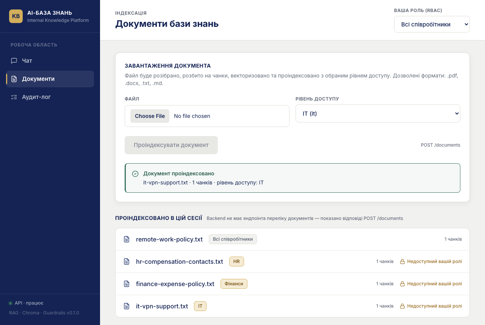
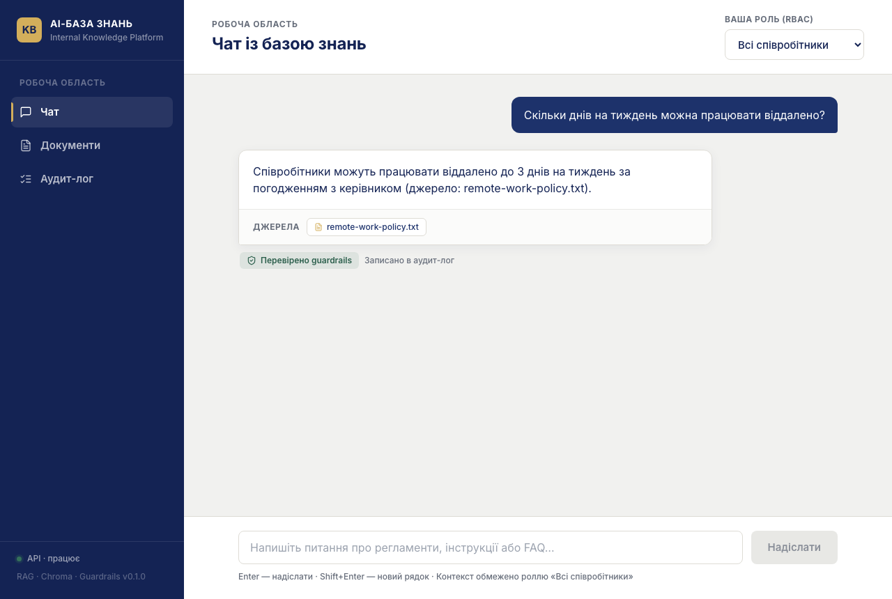
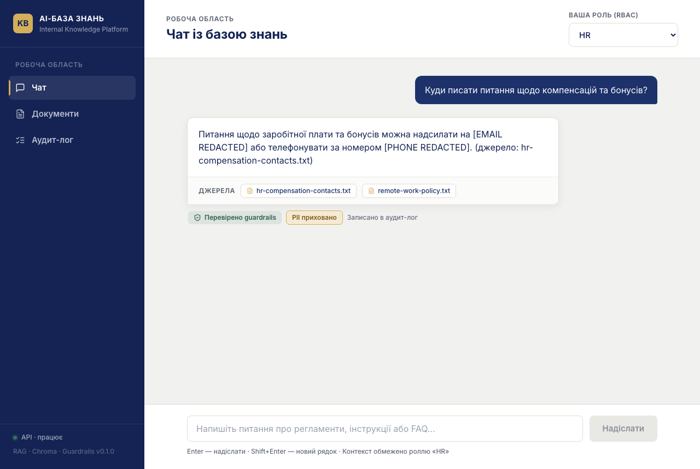
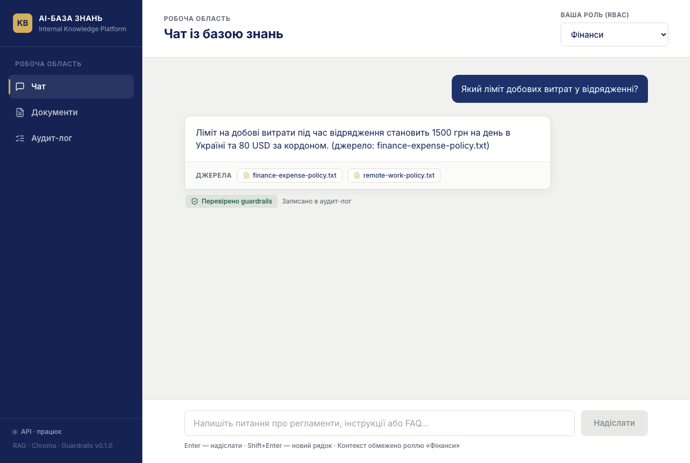
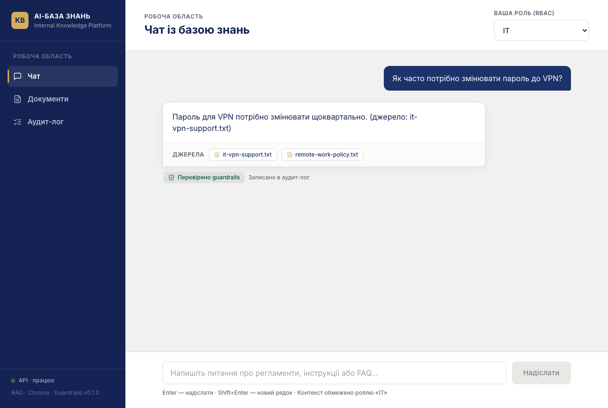
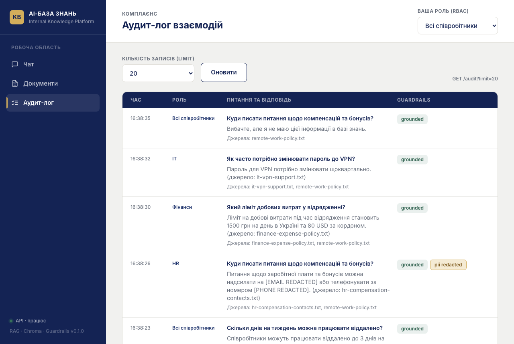

# AI-база знань — уніфікований проєкт (FastAPI backend + Next.js frontend)

Єдиний репозиторій: RAG-бекенд на FastAPI/LangChain/Chroma та Next.js-фронтенд,
повністю під'єднаний до реальних API (жодних моків).

```
project-root/
├── backend/                 # FastAPI: POST /documents, POST /chat, GET /audit, GET /health
│   ├── main.py              # API + DTO (ChatRequest/ChatResponse/UploadResponse)
│   ├── rag.py               # parsing → chunking → RBAC retrieval → LLM
│   ├── guardrails.py        # PII-редакція + LLM-суддя (grounded/toxic)
│   └── audit_log.py         # запис/читання логу взаємодій
├── frontend/                # Next.js 14 (App Router) + TypeScript + Tailwind
│   ├── app/                 # /(чат), /documents, /audit
│   ├── components/          # UI-кіт за затвердженим дизайном
│   ├── hooks/               # useChat, useUpload, useAudit, useHealth
│   ├── lib/                 # api.ts (клієнт), types.ts (контракти), config.ts, roles.ts
│   └── context/RoleContext.tsx
├── sample-docs/             # тестові документи (all / hr / finance / it)
├── scripts/                 # Playwright-скрипт для скріншотів
├── screenshots/             # скріншоти для розділу "Демонстрація"
├── docker-compose.yml       # весь стек: frontend + backend + Chroma (+ ollama за профілем)
├── .env.example
└── PROPOSAL.md
```

## Швидкий старт (Docker, рекомендовано)

```bash
cp .env.example .env        # вставте OPENAI_API_KEY
docker compose up --build
```

- Застосунок: http://localhost:3000
- Swagger backend: http://localhost:8001/docs

## Локальний запуск без Docker

Backend:

```bash
cd backend
python -m venv .venv && source .venv/bin/activate
pip install -r requirements.txt
export OPENAI_API_KEY=sk-...
export CHROMA_HOST=localhost CHROMA_PORT=8002   # Chroma з docker compose up chroma
export AUDIT_LOG_PATH=./data/audit.log
uvicorn main:app --reload --port 8001
```

Frontend:

```bash
cd frontend
cp .env.example .env.local     # NEXT_PUBLIC_API_URL=http://localhost:8001
npm install
npm run dev                    # http://localhost:3000
npm run build && npm start     # production-збірка
npm run typecheck              # перевірка типів
```

## Конфігурація

| Змінна | Де | Опис |
|---|---|---|
| `OPENAI_API_KEY` | backend | Ембединги + генерація |
| `OPENAI_CHAT_MODEL` | backend | За замовчуванням `gpt-4o-mini` |
| `LLM_PROVIDER` | backend | `openai` (default) або `ollama` |
| `CHROMA_HOST` / `CHROMA_PORT` | backend | Адреса Chroma |
| `AUDIT_LOG_PATH` | backend | Шлях до audit-логу |
| `NEXT_PUBLIC_API_URL` | frontend | Базовий URL API з боку браузера. **Ніде не захардкоджений** — читається в `frontend/lib/config.ts`. У Docker передається і як build-arg, і як runtime-env |

## Мапа UI → API

| Екран | Дія | Backend |
|---|---|---|
| `/` Чат | Надіслати питання | `POST /chat` — `{question, history, role}` → `{answer, sources}` |
| `/` Чат | Роль RBAC (селектор у хедері) | поле `role` кожного запиту; зберігається в `localStorage` |
| `/documents` | Завантажити документ | `POST /documents` — multipart `file` + `access_level` → `{filename, chunks_indexed, access_level}` |
| `/audit` | Журнал взаємодій | `GET /audit?limit=` → `{entries: [...]}` |
| Сайдбар | Індикатор стану API | `GET /health` (опитування кожні 30 с) |

Типи у `frontend/lib/types.ts` відповідають DTO бекенда 1:1; окремих дублюючих
доменних моделей немає.

## Стани та обробка помилок

- **Loading:** індикатор "друкує" в чаті, спінер і disabled-кнопка при завантаженні
  файлу, скелетони в таблиці аудиту.
- **Empty:** порожній чат із прикладами питань, порожній список документів, порожній аудит-лог.
- **Error:** `ApiError` (`frontend/lib/api.ts`) нормалізує 400 / 401 / 403 / 404 / 422 / 5xx
  і мережеві збої; UI показує іконку + заголовок + текст `detail` з FastAPI та кнопку повтору.
  Помилка ніколи не передається лише кольором.
- **Success:** підтвердження індексації з реальними `chunks_indexed` та `access_level` з відповіді.
- **Guardrails:** бейджі `grounded` / `not grounded` / `pii redacted` / `toxic` — і в чаті,
  і в аудит-логі, на основі реальних полів відповіді та логу.

## Автентифікація

У бекенді автентифікації немає: роль (`all` / `hr` / `finance` / `it`) — це симульований
RBAC-параметр запиту, як у `rag.VALID_ROLES`. Тому фронтенд не має логіну, токенів чи
захищених маршрутів — свідомо, щоб не вигадувати контракти, яких немає. RBAC-фільтрація
на retrieval справжня (Chroma `where` за `access_level`). Обробка 401/403 у клієнті вже
реалізована й запрацює, щойно бекенд додасть автентифікацію.

## Дизайн

Фронтенд відтворює затверджений дизайн: dominant deep navy, gold як accent/CTA,
off-white робоча область, білі картки, тонкі borders, subtle shadows, uppercase
section headings, Inter, spacing 8px, radius 8/12/16, line-іконки Lucide.
Токени — у `frontend/app/globals.css` (CSS variables) та `frontend/tailwind.config.ts`;
hex-значення в компонентах не використовуються. Layout адаптивний: сайдбар
згортається в drawer на tablet/mobile, таблиця аудиту перебудовується в картки.

## Як протестувати

1. Відкрийте http://localhost:3000 → **Документи** і завантажте файли з `sample-docs/`:
   `remote-work-policy.txt` → `all`, `hr-compensation-contacts.txt` → `hr`,
   `finance-expense-policy.txt` → `finance`, `it-vpn-support.txt` → `it`.
2. Роль `HR`, питання *"Куди писати питання щодо компенсацій та бонусів?"* — email і телефон
   у відповіді будуть замінені на `[EMAIL REDACTED]` / `[PHONE REDACTED]`.
3. Роль `Всі співробітники`, те саме питання — чесна відмова (RBAC відфільтрував документ
   ще на етапі retrieval).
4. Розділ **Аудит-лог** — усі взаємодії з ролями, джерелами та вердиктами guardrails
   (те саме, що `curl http://localhost:8001/audit`).

## Демонстрація: MVP у дії

Скріншоти нижче — не макети. Вони згенеровані `scripts/capture_screenshots.py`
(Playwright, headless Chromium) проти живого стека з `docker compose up`: чотири
документи з `sample-docs/` реально проіндексовані через `/documents`, а кожна
відповідь у чаті — реальний виклик `/chat` (retrieval у Chroma → `gpt-4o-mini` →
guardrails), без жодного мокання. Перегенерувати самостійно:

```bash
docker compose up -d
pip install playwright && playwright install chromium
python3 scripts/capture_screenshots.py   # → screenshots/*.png
```

**1. Документи → індексація.** Усі 4 тестові документи завантажені, кожен зі своїм
`access_level`; картки одразу показують, яким ролям файл недоступний.



**3–6. Одна відповідь на роль — RBAC-фільтрація видна в джерелах.**

| Роль | Питання | Відповідь |
|---|---|---|
| Всі співробітники | *Скільки днів на тиждень можна працювати віддалено?* |  |
| HR | *Куди писати питання щодо компенсацій та бонусів?* |  — email/телефон приховані бейджем `PII приховано` |
| Фінанси | *Який ліміт добових витрат у відрядженні?* |  |
| IT | *Як часто потрібно змінювати пароль до VPN?* |  |

**7. Аудит-лог.** Усі попередні запити — з роллю, джерелами і вердиктом guardrails
(`grounded` / `pii redacted`) для кожного.



## Обмеження демо-версії

Незмінні відносно вихідного MVP (деталі — у [PROPOSAL.md](PROPOSAL.md)): немає реальної
автентифікації/SSO, немає синхронізації з Confluence/Drive, PII-редакція — regex, історія
чату живе лише в пам'яті вкладки (бекенд не має ендпоінта її читання; аудит-лог зберігає
взаємодії на сервері).
